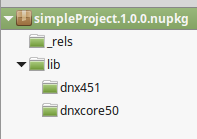

Working with DNX Projects
=========================

Creating a new project
----------------------

At its simplist form a DNX project is a project.json with a code file:

::

    -MyApp
    --project.json
    --Program.cs

The only mandatory part of a project is that the *project.json* is a valid json file, which means it has at least *{ }* inside it, and that your program.cs is valid C#. You can run a project like the one I have described by navigating to the *MyApp* directory and running ``dnx . run``.

The presence of a *project.json* is what defines a DNX project and it is the *project.json* that defines all the information that the DNX needs to run and package your project. 

When using some editors there are other files (.xproj in the case of Visual Studio), these files are features/requirements of their tool and not a requirement of the DNX. The xproj, for example, is an MSBuild file that is used by Visual Studio and keeps information that is important to Visual Studio, but not impactful for the DNX.

Adding package metadata
-----------------------

Project metadata is information such as the version of your app, author, etc.

To specify this in the *project.json* you create a key for each of the metadata attributes you care about:

.. code-block:: json

    {
      "version": "0.1-alpha",
      "authors": ["John Doe"],
      "description": "A wonderful library that does nice stuff"
    }
    
* Version: The version of the NuGet package and assemblies generated if you pack/publish your application.
* Authors: The authors and owners section of the NuGet packages nuspec.
* Description: The description of the NuGet package.

.. note:: Other metadata can be put into the *project.json*, but the three above are the only ones that will go into the nuspec of the package that is generated.

Including/Excluding Files
-------------------------

By default all code files in a directory containing a *project.json* are included in the project. You can control this with the include/exclude sections of the *project.json*.

Including/Excluding files
^^^^^^^^^^^^^^^^^^^^^^^^^

The most common sections that you will see for including and excluding files are:

.. code-block:: json

    {
      "compile": "*.cs",
      "exclude": [
        "node_modules",
        "bower_components"
      ],
      "publishExclude": [
        "**.xproj",
        "**.user",
        "**.vspscc"
      ]
    }

* The *compile* section means that only .cs files will be compiled.

* The *exclude* section would exclude any files in the node_modules and bower_components directories. Even if they have .cs extensions.

* The *publishExclude* section of the project.json allows you to exclude files from the publish output of your project. In this example all xproj, user, and vspscc files from the output of the publish command. See TODO: :doc:`Publishing DNX Applications <publishing>`

.. note:: Most sections of the project.json that deal with files allow `glob patterns <https://en.wikipedia.org/wiki/Glob_programming>`_, often called wildcards. 

List of supported properties for sources
^^^^^^^^^^^^^^^^^^^^^^^^^^^^^^^^^^^^^^^^

+---------------------+--------------------------------------+-----------------------------------+
| name                | default value                        | remark                            |
+=====================+======================================+===================================+
| compile             |                                      |                                   |
+---------------------+--------------------------------------+-----------------------------------+
| compileExclude      |                                      |                                   |
+---------------------+--------------------------------------+-----------------------------------+
| content             | ``**/*``                             |                                   |
+---------------------+--------------------------------------+-----------------------------------+
| contentExclude      |                                      |                                   |
+---------------------+--------------------------------------+-----------------------------------+
| preprocess          | ``compiler/preprocess/**/*.cs``      |                                   |
+---------------------+--------------------------------------+-----------------------------------+
| preprocessExclude   |                                      |                                   |
+---------------------+--------------------------------------+-----------------------------------+
| resource            |``compiler/preprocess/resources/**/*``|                                   |
+---------------------+--------------------------------------+-----------------------------------+
| resourceExclude     |                                      |                                   |
+---------------------+--------------------------------------+-----------------------------------+
| shared              | ``compiler/shared/**/*.cs``          |                                   |
+---------------------+--------------------------------------+-----------------------------------+
| sharedExclude       |                                      |                                   |
+---------------------+--------------------------------------+-----------------------------------+
| bundleExclude       | ``bin/**;obj/**;**/.*/**``           |                                   |
+---------------------+--------------------------------------+-----------------------------------+
| exclude             |                                      |                                   |
+---------------------+--------------------------------------+-----------------------------------+

Advanced Properties
^^^^^^^^^^^^^^^^^^^

In adition to the above table there are some extra properties that you will not use as often.

* The names ending in BuiltIn control the built in values of their associated key. E.g. *compile* always has the value of *compileBuiltIn* appended to it.
* The names ending in Files are ways to specify an individual file, without globbing. These are here so that you can do things like "exclude all files in folder x except this one file that I care about".

+---------------------+-------------------------------------+-----------------------------------+
| name                | default value                       | remark                            |
+=====================+=====================================+===================================+
| compileBuiltIn      | ``**/*.cs``                         | Concatenated to compile.          |
+---------------------+-------------------------------------+-----------------------------------+
| excludeBuiltIn      | ``bin/**;obj/**;*.kproj``           |                                   |
+---------------------+-------------------------------------+-----------------------------------+
| compileFiles        |                                     | Wildcard is not allowed           |
+---------------------+-------------------------------------+-----------------------------------+
| contentFiles        |                                     | Wildcard is not allowed           |
+---------------------+-------------------------------------+-----------------------------------+
| preprocessFiles     |                                     | Wildcard is not allowed           |
+---------------------+-------------------------------------+-----------------------------------+
| resourceFiles       |                                     | Wildecard is not allowed          |
+---------------------+-------------------------------------+-----------------------------------+
| sharedFiles         |                                     | Wildecard is not allowed          |
+---------------------+-------------------------------------+-----------------------------------+

Precedence
^^^^^^^^^^

The sequence of searching are:

1. Gather files from include patterns
2. Exclude files from ignore patterns
3. Exclude files from includes of mutually exclusive types (see below)
4. Adding individually specified files

The following describes the exact lists that are built up with the following notation:

* \+ means included
* \- means excluded
* glob() means the values are used in the globbing algorithm.

::

    CompileList =
      +Glob( +compile +compileBuiltIn -compileExclude -exclude -excludeBuiltIn) 
      -SharedList
      -PreprocessList
      +compileFiles
    
    PreprocessList =
      +Glob( +preprocess -preprocessExclude -exclude -excludeBuiltIn) 
      +preprocessFiles
    
    SharedList =
      +Glob( +shared -sharedExclude -exclude -excludeBuiltIn) 
      +sharedFiles
    
    ResourceList =
      +Glob( +resource -resourceExclude -exclude -excludeBuiltIn) 
      +resourceFiles
    
    ContentList =
      +Glob( +content -contentExclude -exclude -excludeBuiltIn) 
      -CompileList
      -PreprocessList
      -SharedList
      -ResourcesList
      +contentFiles
    
    BundleExcludeList =
      +Glob ( +bundleExclude )

Targeting multiple frameworks
-----------------------------

One of the sections you can add to the *project.json* is the ``frameworks`` section. The ``frameworks`` section looks like this

.. code-block:: json
    {
      "frameworks": {
        "dnx451": {},
        "dnxcore50": {}
      }
    }

Each of the values in the ``frameworks`` section of the *project.json* is a framework that your project will compile for. If you pack this project, using ``dnu pack`` then you will get a NuGet package that looks like the following:

Notice that the nupkg has a folder for each of the frameworks you specified, allowing this NuGet package to work on any of the frameworks you specified. You can also do this

.. code-block:: json

    {
      "frameworks": {
        "dnxcore50":{},
        ".NETPortable,Version=v4.5,Profile=Profile7":{}
      }
    }

With the above ``frameworks`` section you will generate a package with a *portable-net45+win* folder that will be used when running on platforms that match that portable profile.

Dependencies
------------

You manage the dependencies of your application with the ``dependencies`` section of your *project.json*

.. code-block:: json

    {
      "dependencies":{
        "Microsoft.AspNet.Mvc": "6.0.0-beta4"
      }
    }

The above *project.json* section tells the DNX that you depend upon Microsoft.AspNet.Mvc, which means you also depend on everything that the MVC package depends on.

When talking about dependencies it is often easiest if you imagine a dependency tree, where your application is the root node of the tree and every package and project you depend on a node.

*dependencies* can also

Restoring packages
------------------

In order to get all the packages that your application depends on you need to restore them from by running ``dnu restore`` in the directory where your *project.json* is. This command will download all the packages required to run, assuming your *project.json* lists everything of course.

The DNX Utility (DNU) wraps the functionaliy of NuGet to do package restore, which means that it uses the NuGet.config file to determine where to download package from. If you want to get packages from somewhere other than NuGet.org you should edit your NuGet.config.

There are instructions on how to get development builds of the latest ASP.NET and DNX packages here: https://github.com/aspnet/Home/wiki/Configuring-the-feed-used-by-dnu-to-restore-packages

Project lock file
-----------------

When doing a package restore DNU builds up a great deal of information about the dependencies of your application, this information is persisted to disk in the project.lock.json.

The DNX reads the lock file when running your application instead of rebuilding all the information that DNU already generated. To understand the reason for that, imagine what the DNX has to do without the lock file:

1. Find each dependency listed in the project.json
2. Open the nuspec of each package and get all of their dependencies
3. Repeat step 2 for each dependency until you have the entire graph.
4. Load all the dependencies.

With the lock file this is reduced to:

1. Read the lock file
2. Load all the dependencies

There is significantly less disk IO involved in the second list. 

.. Note:: Because it has such a large impact on the cold start performance of DNX applications the lock file is mandatory to run. If you do not have one the DNX will fail to load your application.

In adition to this DNU also does things like determine if the package should be breadcrumbed for servicing and marks it as such in the lock file. See :doc:`Servicing DNX Applications <servicing>`

Referencing other projects
--------------------------